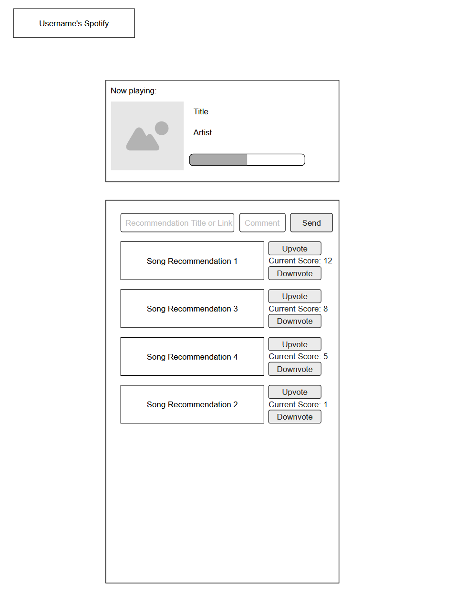

# CS408 Final Project

## Spotify Status Project Spec

This project is a website that lets people show what music they are currently listening to on Spotify and also lets their friends send them song recommendations. It works kind of like the Spotify status you see on Discord, where it shows the song someone is listening to, but this website expands that idea into a small social platform. Instead of the status only showing inside Discord, anyone can visit a user’s page on the site to see what they’re listening to. The main goal is to create a fun place for people to share music with friends in an easy and visual way.

The theme of the project is basically a music social hub. It’s not a full social media site, but it includes elements of profiles, sharing, recommendations, and voting. The website uses the Spotify API (with the user’s permission) to read information like what song is playing. After logging in once, users can get a simple personal page that updates whenever they change songs on Spotify.

The main idea of the website is to make music sharing feel fun and easy. Instead of sending links in group chats or trying to describe what you’re listening to, you have a personal page that always stays updated.

### Here are the main things the website will do:

1. Show the User’s Currently Playing Song

2. After logging in with Spotify, the website will:

3. Read the song the user is currently listening to

4. Show the track name, artist, and album

5. Display the album cover

6. Show a progress bar for the song

7. Update automatically when the song changes

8. This gives people a live window into someone’s music taste.

9. Give Each User Their Own Page

Every user gets a URL like: `domain.com/username`

This page can be shared with friends, posted on Discord, or even put in a bio on a social profile. Anyone who opens the link will be able to see what that user is listening to, without needing to log in.

### Allow Friends to Send Song Recommendations

Visitors will be able to suggest songs by submitting:

- A Spotify link

- A short note about why the user should listen to it (optional)

These recommendations get added to a list under the user's currently playing song. The user can then check them out later.

### Types of Data the Website Will Handle

The website will deal with dynamic, user-generated data. This means information that changes depending on what the user is doing or what other people submit.

#### Here’s the data it will manage:

From Spotify

- The user’s currently playing song

- Song details: title, artist, album, duration

- Album art

- Possibly recent songs (optional)

From Users and Visitors

- Usernames and account profiles

- Recommendations from friends

- Votes on those recommendations

- Comments attached to recommendations

Created by the Website

- URLs for each user

- Ranking scores for recommendations

Since this is a live-updating music display, most of the information will come directly from Spotify’s API and from visitor interactions.

### Stretch Goals

- Real time updating with websockets or some other option
- A recently played songs section
- Different website themes
- Some sort of chart/statistic viewer for each user

## Project Wireframe

